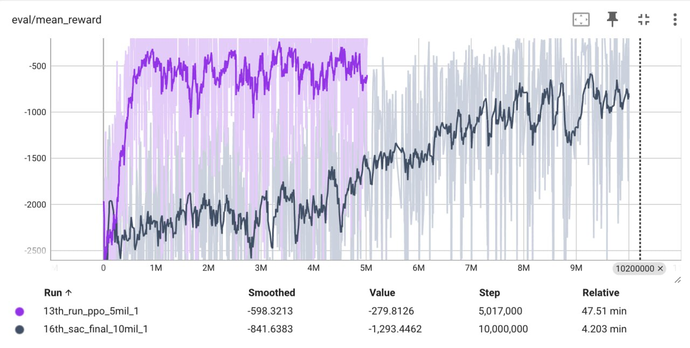

# GYM-CANNON


## Overview

This project is a simple enviroment for Reinforcement learning with GYM interface.  
The task is to engage the target with not more than 10 shots. 

The Observation consists of a cannon angle and a distance to the target. 
The agent needs to predicts proper starting speed of the projectile to engage the target.

The engagement reward is 100 and the episode is terminated after it. 
Each saved shot rewarded with 10. 
If agent doesn't engage the target with 10 shots it penalized with -100 reward. 
After each shot agent receives the penalty proportional to the error (the difference between targent and the calculated point of impact).


The project provides the script for training two different agents: SAC and PPO. 
It also provides evaluation scrips for SAC, PPO and random agents. 
It also provides console interface so you can try env as well.

## Usage

### Installation 

You can use conda for creation environment for the project.

```bash
conda create --name gym_cannon python=3.9
conda activate gym_cannon 
cd gym-cannon 
pip install -r requirements.txt
```

### Train

```bash
python train_ppo.py # for training ppo agent
python train_sac.py # for training sac agent
```

### Eval 

```bash
python play --mode human                              # for human play
python play --mode random                             # for random agent evaluation
python play --mode ppo --model_name models/ppo_model  # for ppo agent evaluation
python play --mode ppo --model_name models/sac_model  # for sac agent evaluation
```

## Performance 

Here you can see a plot of mean reward during training. 

As you can see PPO is trained with less samples and achieve better results. 

| model    | average number of engagements per 1000 episodes |
| -------- | ---------------------------------------------- |
| PPO      | 252                                            |
| SAC      | 56                                             |
| Random   | 22                                             |
 

